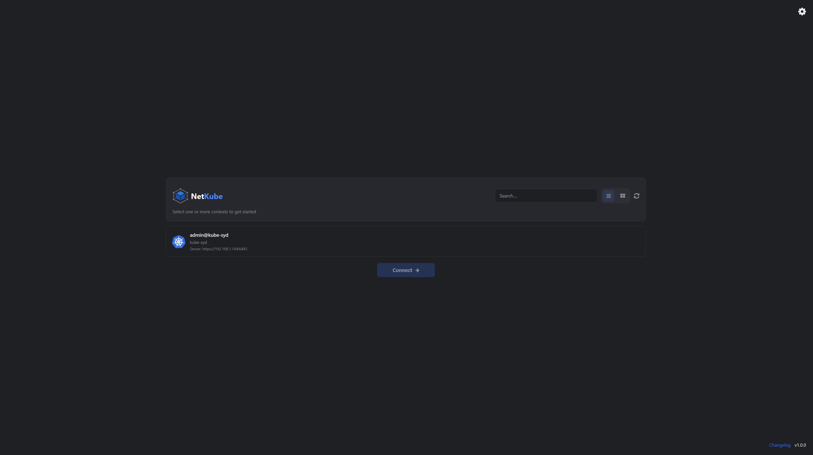
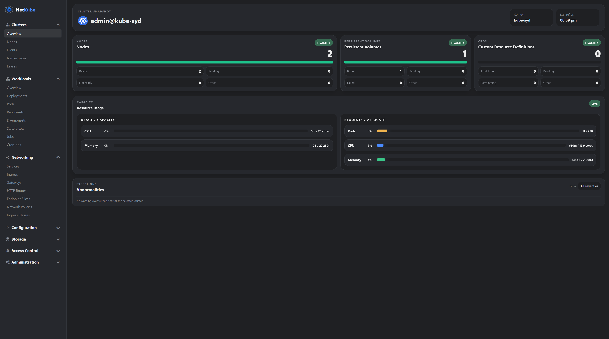
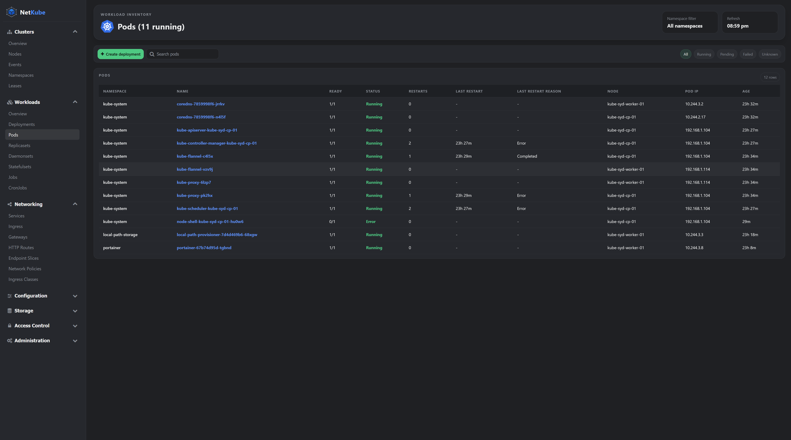
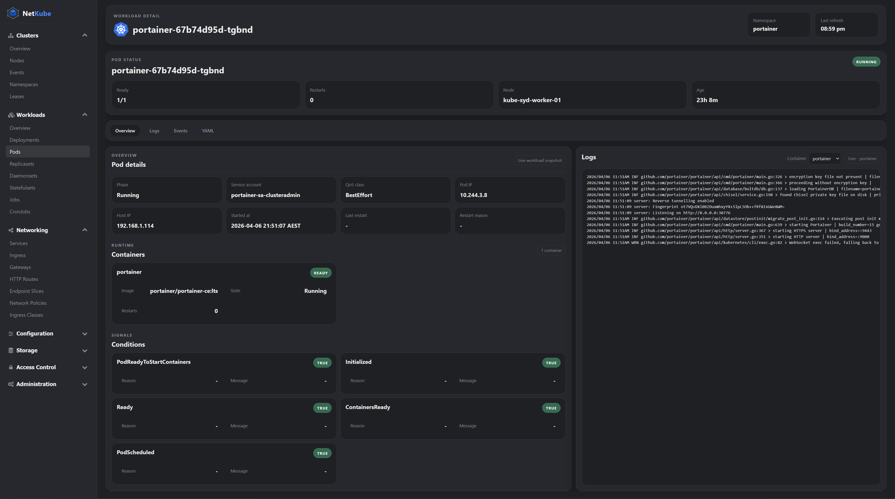

# NetKube

NetKube is a simple Kubernetes dashboard for viewing cluster health, nodes, pods, deployments, services, and multi-context kubeconfig data.

It provides a lightweight web interface for inspecting cluster resources, switching between stored kubeconfig contexts, and reviewing operational details without the overhead of a larger Kubernetes management platform.

Create a `.env` file before starting the app. NetKube requires `EMAIL` (or legacy `USERNAME`) and `PASSWORD` for login. If `SESSION_SECRET` is not set, NetKube will generate and persist a secure session secret automatically.

## What does it look like?
<table>
	<tr>
		<td></td>
		<td></td>
	</tr>
	<tr>
		<td></td>
		<td></td>
	</tr>
</table>

## Run with Docker

```bash
docker build -t netkube:latest .
docker run --rm -p 3000:3000 -v netkube-config:/app/config netkube:latest
```

## Deploy to Kubernetes

Build the image and push it to a registry your cluster can pull from, then update the image in `deploy/kubernetes/deployment.yaml`.

```bash
docker build -t <registry>/netkube:latest .
docker push <registry>/netkube:latest
kubectl apply -f deploy/kubernetes/namespace.yaml
kubectl apply -f deploy/kubernetes/pvc.yaml
kubectl apply -f deploy/kubernetes/deployment.yaml
kubectl apply -f deploy/kubernetes/service.yaml
kubectl -n netkube port-forward svc/netkube 3000:3000
```

The app persists uploaded kubeconfig files and selected contexts under `/app/config`, so the deployment mounts a persistent volume claim for that data.
